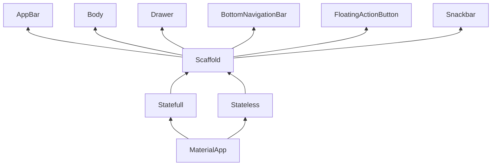

# **AULA 1 - INTRODUÇÃO A MOBILE (27-01-26)**

Tivemos um momento de apresentação dos docentes, divisão de classe por chamada (17 pessoas cada lado da sala), após isso cada aluno deu uma breve introdução sobre si mesmo, com nome, idade e se deseja seguir na área de TI, se sim ou não, qual área deseja. Também vimos combinados e uma apresentação detalhada do professor Diogo.

Hoje foi nossa primeira aula do ano então apenas **organizamos nosso ambiente de desenvolvimento.**

- Criamos nossos perfis nos computadores da sala, com nome e senha padrões _(2DevSESI)_
- Instalamos ferramentas fundamentais como **Git & VS Code**
- Autenticamos nosso e-mail e usuário no Git Bash
  - Comandos do bash `git config --global user.email 'email@email.com'` e `git config --global user.name 'usuario'`
- Autenticamos e criamos nossos perfis no VS Code
  - Perfil `Web` com configs importadas padrões para trabalhar com Node.js
  - Perfil `Flutter` sem nenhuma predefinição para as aulas mobile
- Testamos a extensão **Live Share**
  - Essa extensão permite a transmissão de tela/terminal de um Host, facilitando o acompanhamento dos alunos
- Decidimos os representantes de classe, Murilo & Lorenzo
- E criamos nossa pasta e uma pasta para cada matéria do semestre
  - Com os comandos básicos `cd` e `mkdir`
- Logo em seguida criamos esse arquivo, com `type null > README.md`

---

# **AULA 2 - INTRODUÇÃO AO DESENVOLVIMENTO MOBILE (03-02-26)**

## **TIPOS DE DESENVOLVIMENTO**

### **Nativo:** Desenvolvimento feito para um dispositivo somente _(Android/IoS)_

- _Android:_
  - **SDK - Android SDK**
  - **IDE - Android Studio**
  - **Linguagens - Kotlin & Java**
  - **Ambientes - Mac, Win, Linux**

- _IoS:_
  - **SDK - Cocoa Touch**
  - **IDE - XCode**
  - **Linguagens - Swift & Objectype-C**
  - **Ambientes - Mac**

### **Multiplataforma:** Desenvolvimento feito em uma linguagem para multiplos dispositivos

- _React Native:_
  - **SDK - Node.js**
  - **IDE - Principal VSCode, mas pode mudar**
  - **Linguagens - Javascript / Typescript**
  - **Ambientes - Mac, Win, Linux**

- _Flutter:_
  - **SDK - Flutter SDK**
  - **IDE - Android Studio ou VSCode**
  - **Linguagens - Dart**
  - **Ambientes - Mac, Win, Linux**

# **AULA 3 - INSTALAÇÃO FLUTTER E ANDROID SDK, PRIMEIROS PASSOS EM FLUTTER (10-02-26)**

Hoje realizamos a extração dos zips baixados na última aula (Flutter SDK & Android CLI), fizemos toda a inclusão no PATH e instalamos arquivos importantes do Android SDK com as ferramentas em CLI (Command Line)

**Componentes instalados do Android SDK:**

- Platform Tools
- Build Tools
- Emulator
  - `sdkmanager --install "platform-tools" "platforms;android-34" "build-tools;34.0.0" "emulator"`

Inclusão do ADB (Android Debug Bridge) e Emulator no PATH.

_O Android Debug Bridge é uma ferramenta CLI versátil do AndroidSDK que nos permite fazer uma comunicação entre o computador e o dispositivo móvel via depuração USB ou Wi-Fi_

**Build Emulador:**

- Instalando a ISO Android:

``sdkmanager --install "system-images;android-34;google_apis;x86_64"``

- Criando emulator:

``avdmanager create avd -n MeuEmulador -k "system-images;android-34;google_apis;x86_64" --device "pixel_4"``

- Iniciando emulator:

``emulator -avd MeuEmulador -no-snapshot``

---

# **AULA 4 - CRIAÇÃO DE PROJETOS, COMANDOS DA CLI (24-02-26)**

**CRIAÇÃO DE PROJETOS:**

- ``flutter create nome_do_app``

  - _Flags (parametros):_

    - ``--empty`` → Cria um projeto vazio (Hello World!)

    - ``--platforms`` → Permite a seleção de uma pool de plataformas _(win/lin/macOS/android/ios)_

      - Exemplo: ``flutter create meuApp --empty --platforms=android`` → Cria um projeto vazio apenas para android

**OBS:** _Nome do app → todas letras minúsculas, separação de palavras com ``"_"``_

**DIAGNÓSTICO:**

- ``flutter doctor`` → Permite a correção de pequenos erros, checagem de dependências e identificação de parametros, **sempre** usar no começo do projeto

- ``flutter clean`` → Limpa o cache da build (apagando o apk anterior)

- ``flutter run -v`` → Build do apk com verbose

**PUB (GERENCIADOR DE PACOTES):**

_PUB → Public_

- ``flutter pub add <nome-dependencia>`` → Adiciona uma dependência ao ````pubspec.yaml````, o arquivo que guarda as bibliotecas do projeto

- ``flutter pub get`` → Instala todas as dependências dentro do ````pubspec.yaml````

# **AULA 5 - ESTRUTURA DE APPs MOBILE - ELEMENTOS PAI, FILHO, ETC. (03-03-26)**

**WIDGETS:**

São elementos fundamentais (componentes) que podem ser reutilizados no meu código

_Exemplo:_

````
Tela
  Coluna
    Centralizado
    AppBar
      Texto Principal
````

Cada um desses seria uma classe, um componente, que tem suas propriedades, note que tem uma certa hierarquia

**ÁRVORE DE WIDGETS:**

Os widgets são organizados hierarquicamente em uma estrutura de árvore.

Cada aplicativo Flutter possui um widget principal chamado **MaterialApp ou CupertinoApp**

Ele serve como a **raiz** da árvore de widgets. Dentro dessa árvore, cada widget tem um **pai** e **zero ou mais filhos**

_Pai:_

É o widget que contém outros widgets

_Filho:_

O widget que está dentro do elemento pai

_Pense no HTML, um container seria um elemento pai, os elementos dentro dele são os filhos_

_Exemplo:_

````
<html> → Pai raiz do projeto
  <head>
  <body>
    <header>
      <div>
        <nav>
    <section>
      <div>
      <div>
        <div>
````

_Aqui:_

``<head>`` & ``<body>`` → Elementos filhos de ``<html>``

``<header>`` & ``<section>`` → Elementos filhos de ``<body>``

``div`` → Elementos filhos dentro de ``<header>``, ``<section>``, até outra ``<div>`` na última linha

_Widgets na parte inferior da árvore costumam ser de alto nível, como páginas e layouts, e á medida que você sobe na árvore, os widgets se tornam mais específicos_

**WIDGETS DE ESTRUTURA:**

São as bases que fornecem a estrutura base da tela, estruturando a UI

_Scaffold:_

O scaffold fornece a estrutura básica da tela, e já vem com widgets embutidos, como os abaixo:

- AppBar (barra superior de navegação)

- Body (corpo da tela)

- FloatingActionButton (botão flutuante)

- Drawer (menu lateral)

- BottomNavigationBar (barra de navegação inferior)

- SnackBar (notificações curtas)

_Exemplo:_

````
import 'package:flutter/material.dart';

void main() {
  runApp(MyApp());
}

class MyApp extends StatelessWidget {
  @override
  Widget build(BuildContext context) {
    return MaterialApp( → Base
      home: Scaffold( → Scaffold
        appBar: AppBar( → Appbar
          title: Text('Exemplo de Scaffold'),
          backgroundColor: Colors.blue,
        ),
        body: Center( → Body, com texto no center
          child: Text('Conteúdo da tela', style: TextStyle(fontSize: 20)),
        ),
        floatingActionButton: FloatingActionButton(
          onPressed: () {
            print('Botão pressionado!');
          }, → Botão flutuante, com ação ao clicar
          child: Icon(Icons.add),
        ),
        bottomNavigationBar: BottomNavigationBar(
          items: [
            BottomNavigationBarItem(icon: Icon(Icons.home), label: 'Home'),
            BottomNavigationBarItem(icon: Icon(Icons.person), label: 'Perfil'),
          ],
        ),
      ),
    );
  }
}
````

# **AULA 6 - A ÁRVORE DE ELEMENTOS - VISUALIZAÇÃO - STATELESS & STATEFULL (26-03-26)**

